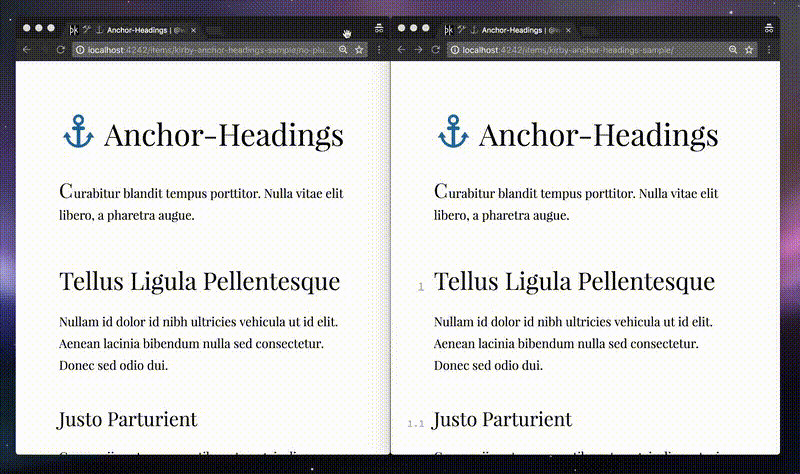

# ⚓ Kirby Anchor-Headings by [@wottpal](https://twitter.com/wottpal)

<!-- Buttons -->

[](https://raw.githubusercontent.com/wottpal/kirby-anchor-headings/master/LICENSE)
[](https://twitter.com/intent/tweet?text=&#x2693;&#x20;&#x41;&#x6E;&#x63;&#x68;&#x6F;&#x72;&#x2D;&#x48;&#x65;&#x61;&#x64;&#x69;&#x6E;&#x67;&#x73;&#x20;&#x66;&#x6F;&#x72;&#x20;&#x40;&#x67;&#x65;&#x74;&#x6B;&#x69;&#x72;&#x62;&#x79;&#x20;&#x62;&#x79;&#x20;&#x40;&#x77;&#x6F;&#x74;&#x74;&#x70;&#x61;&#x6C;&url=https://git.io/v7aFU)


(_Disclaimer:_ This is a pre-release.)

A field-method for the [Kirby CMS](https://getkirby.com) which automagically enumerates your headings, generates IDs for them and inserts matching anchor links. Customizable to it's core. 🤘



*Note:* Please dive into this [advanced use case](ADVANCED.md) if you want to build something like the GIF above.


# Demos

* [wottpal.com](http://wottpal.com/items/kirby-anchor-headings) (my personal site)
* **[Submit yours](https://twitter.com/wottpal)**


# Installation

Use [Kirby's CLI](https://github.com/getkirby/cli) and install the plugin via: `kirby plugin:install wottpal/kirby-anchor-headings` or place the repo manually under `site/plugins`.

🎉 **That's it.**


# Usage

This is a kirby field-method, so you can basically just do:

```html
<?= $page->text()->kirbytext()->headingAnchors() ?>
```


# Options

The following options can be set globally in your `config.php` with `c::set($key, $value = null)`. You can also set multiple keys with `c::set([$key => $value, ..])`. 🤓

**Please prefix every key with `anchorheadings.`!**

key               | default | description
----------------- | ------- | ------------------------------------------------
`heading.min`     | `2`     | The `<h>`-level to _begin_ enumeration.
`heading.max`     | `3`     | The `<h>`-level to _end_ enumeration.
`enum.start`      | `1`  | Integer to start enumeration on each level.
`enum.seperator`  | `'.'` | Seperator for enumeration-levels.
`id.prefix` | `false` | A string all IDs get prefixed with (before the enumeration).
`id.prepend.enum` | `true` | If the enumeration should be part of the generated ID.
`id.rules`        | _(see below)_ | A dictionary of reg. expressions and their respective replacements. (They will be applied in the given order.)
`markup`          | _(see below)_ | A template-string which defines the new inner-markup of each heading-element


#### Set `id.prefix`

Even if `id.prefix` defaults to `false` I encourage you to set it to something like `section-` to prevent namespace-conflicts all over your site.


#### Default of `id.rules`

```php
[
  // characters to replace with an hyphen
  '/[_ ~\/,.]/' => '-',
  // replace German umlauts (YES, even the large ß)
  '/ä/' => 'ae', '/ö/' => 'oe', '/ü/' => 'ue',
  '/Ä/' => 'Ae', '/Ö/' => 'Oe', '/Ü/' => 'Ue',
  '/ß/' => 'ss', '/ẞ/' => 'SS',
  // remove all remaining characters that are not letters/digits
  '/[^A-Za-z0-9\-]/' => '',
  // remove trailing hyphens and squash multiple occurences
  '/-+$/' => '',
  '/-{2,}/' => '-',
]
```

#### Default of `markup`

```html
<a href='#{id}'>{enum}.</a> {heading}
```

You can use the following template-literals in your markup: `{id}`, `{enum}` and `{heading}`. I think they are self-explanatory, but feel free to reach out if you need further guidance.

#### [Advanced Markup & Styling](ADVANCED.md)

# Changelog

Have a look at the [releases page](https://github.com/wottpal/kirby-anchor-headings/releases).


# Roadmap

- [x] Add an [example with advanced markup](ADVANCED.md) & styling to the `README.md`
- [x] Improve ID generation by collapsing consecutive '-' to one
- [ ] Allow non integer values for `enum.start` like `A` or `i` and conitnue enumeration with this style.


# 💰‍ Pricing
Just kidding. This plugin is totally free. Please consider following [me](https://twitter.com/wottpal) on Twitter if it saved your day.

[](https://twitter.com/wottpal)

You can also check out one of [my other Kirby-plugins](https://wottpal.com/items/my-kirby-plugins):

* [Lightbox-Gallery](https://github.com/wottpal/kirby-lightbox-gallery) - Easily inline beautifully aligned galleries with lightbox-support powered by PhotoSwipe.
* [HTML5-Video Kirbytag](https://github.com/wottpal/kirby-video) - Adds a kirbytag for embedding HTML5-videos with a variety of features.
